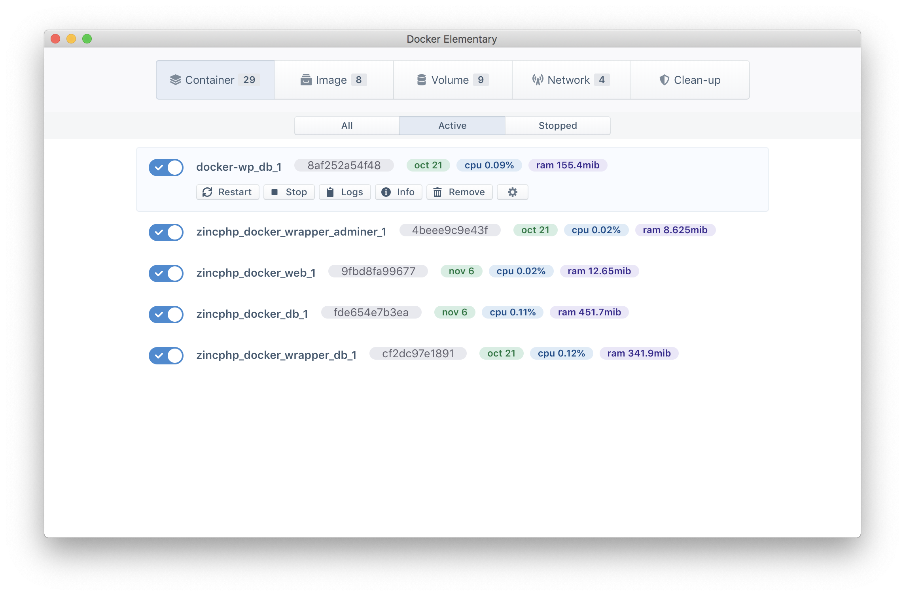

# Docker Elementary

<p align="center">
  
</p>

A simple GUI for managing containers and images of Docker

### A weekend project from <a href="https://twitter.com/rakibtg">@rakibtg</a>

# How to install and run
- Clone this repository
  ```
  git clone https://github.com/rakibtg/Docker-Elementary
  ```
- Open a terminal in the directory where the project was cloned.
- Type `yarn` to install all dependencies.
- Now open two terminal in this directory, on the first terminal type:
  ```
    yarn react-start
  ```
  and on the second terminal type:
  ```
    yarn electron-start
  ```

# Need helo?
I'm using react and redux with electron so if you want to contribute and need any help or any ideas please DM me on twitter <a href="https://twitter.com/rakibtg">@rakibtg</a>

# Download build?
Not yet.

# Progress
Nothing works yet, only the list of containers soon there will be a way to toggle containers on/off.

## * work in progress...